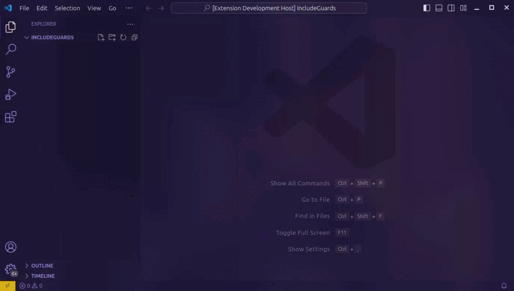

# Include Guard Snippets for C/C++

This extension provides handy snippets for adding include guards to your C/C++ header files. It includes two main snippets:

- **Include Guard**: Automatically generates an include guard based on the filename.
- **Interactive Include Guard**: Allows you to manually specify the guard name.

These snippets help ensure that your header files are protected against multiple inclusions, improving code reliability and maintainability.

_I'm not expecting any updates, because this extension is literally just two snippets, but if you have any ideas or find bugs, let me know on [GitHub](https://github.com/HEJOK254/VSCode-IncludeGuardSnippets/issues)!_

## Features

### Normal Snippet (#guard)

Use a snippet to automatically choose a name and insert an appropriate guard

### Interactive Snippet (#iguard)

If you want to use a different name, use `#iguard` to insert a snippet that will let you choose a different name

### Fill File with Snippet command (both #guard and #iguard)

You can also use the built in vs code `Fill File with Snippet` command to use `#guard` or `#iguard` that way

## Known Issues

The snippets use regex to format the file name, which does not account for different naming conventions, which might result in names that you don't like. If this happens, you can use `#iguard` to manually choose a name, or if you think the name is being formatted weirdly, you can open an [issue](https://github.com/HEJOK254/VSCode-IncludeGuardSnippets/issues) on GitHub.

## Release Notes

For a more detailed changelog, visit: [CHANGELOG.md](CHANGELOG.md) (changelog tab)

### 1.0.1

Fixed licensing

### 1.0.0

Initial release.
